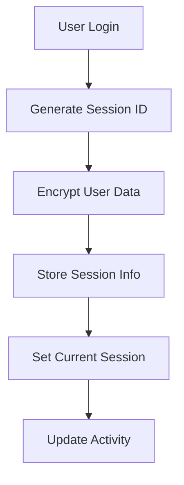
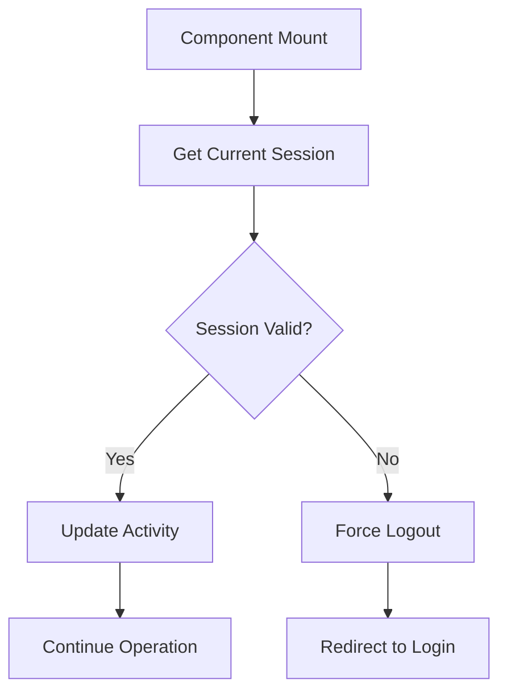
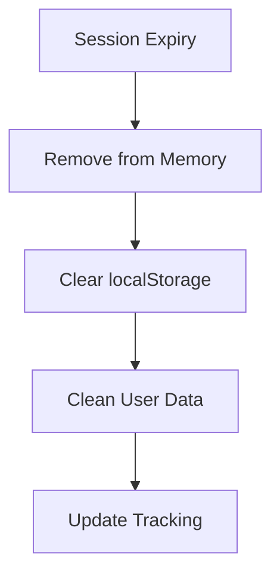

# 🔐 Secure Session System Implementation

**Comprehensive user session isolation system to prevent data leakage and ensure fresh sessions for each user.**

## 🎯 Problem Solved

**Original Issue**: Risk of data sharing between users, potential session conflicts, and lack of proper session isolation in a multi-user academic planning application.

**Solution**: Implemented a cryptographically secure session management system with complete user data isolation.

## 🏗️ Architecture Overview

### Core Components

1. **`SecureSessionManager`** (`/src/utils/sessionManager.ts`)
   - Singleton pattern for centralized session management
   - Cryptographic session ID generation
   - Encrypted data storage
   - Automatic session cleanup
   - Session limit enforcement (max 3 per user)

2. **`SessionAwareComponent`** (`/src/components/SessionAwareComponent.tsx`)
   - Wrapper component for session validation
   - Automatic session timeout detection
   - Data isolation enforcement
   - Session conflict monitoring

3. **`UserSessionControl`** (`/src/components/UserSessionControl.tsx`)
   - User interface for session management
   - Secure user switching
   - Session information display
   - Security status indicators

4. **Enhanced `MicrosoftAuthContext`** (`/src/contexts/MicrosoftAuthContext.tsx`)
   - Integration with session manager
   - Secure token storage
   - Session-based authentication

## 🛡️ Security Features

### 1. Cryptographic Session Security
```typescript
// Session ID format: ses_{uuid}_{timestamp}_{secureToken}
sessionId: "ses_a1b2c3d4-e5f6-7890-abcd-123456789012_1692234567890_xy9z8a7b"
```

- **UUID v4**: Cryptographically random session identifiers
- **Timestamp**: Session creation time for ordering and validation
- **Secure Token**: Additional entropy for tamper detection

### 2. Data Encryption
```typescript
// All session data encrypted using AES encryption
const encryptedData = CryptoJS.AES.encrypt(data, ENCRYPTION_KEY).toString();
```

- **AES Encryption**: All session and user data encrypted at rest
- **Unique Keys**: Per-device encryption keys stored securely
- **No Plain Text**: No sensitive data stored in plain text

### 3. User Data Isolation
```typescript
// Data storage pattern: userData_{userId}_{dataType}
const storageKey = `userData_${session.userId}_${dataType}`;
```

- **User-Scoped Keys**: All data storage scoped to specific user IDs
- **Isolated Storage**: Complete separation of user data
- **Automatic Cleanup**: Session destruction removes all user data

### 4. Session Validation
```typescript
interface SessionValidation {
  isActive: boolean;
  isExpired: boolean;
  belongsToUser: boolean;
  isSecure: boolean;
}
```

- **Continuous Validation**: Sessions validated every 5 minutes
- **Expiration Checking**: Automatic timeout after 24 hours
- **Integrity Verification**: Session tampering detection
- **Activity Tracking**: Last activity timestamp updates

## 🔄 Session Lifecycle

### 1. Session Creation


### 2. Session Validation


### 3. Session Cleanup


## 📋 Implementation Details

### Files Created/Modified

#### New Files:
- ✅ `/src/utils/sessionManager.ts` - Core session management
- ✅ `/src/components/SessionAwareComponent.tsx` - Session wrapper component
- ✅ `/src/components/UserSessionControl.tsx` - User interface for session control
- ✅ `/src/utils/sessionValidationTest.ts` - Comprehensive security testing

#### Modified Files:
- ✅ `/src/contexts/MicrosoftAuthContext.tsx` - Session integration
- ✅ `/src/App.tsx` - Session-aware wrapper and new UI components
- ✅ `/.env` - Updated Azure configuration for authentication

#### Dependencies Added:
- ✅ `uuid` - Cryptographically secure ID generation
- ✅ `crypto-js` - Data encryption and security
- ✅ `@types/uuid` - TypeScript support

### Configuration Updates

#### Environment Variables
```bash
# Updated Microsoft Azure Authentication
VITE_AZURE_CLIENT_ID=1e1d566f-57bd-4e99-bb30-74db9c62380e
VITE_AZURE_TENANT_ID=4130bd39-7c53-419c-b1e5-8758d6d63f21
```

## 🧪 Security Testing

### Comprehensive Test Suite
The system includes a full security validation test suite (`sessionValidationTest.ts`) that tests:

1. **Basic Session Creation** - Valid session ID generation and validation
2. **Session Isolation** - Different users get different sessions
3. **Data Isolation** - User data completely separated
4. **Session Security** - Encryption and tamper detection
5. **Session Cleanup** - Proper data removal on logout
6. **Concurrent Sessions** - Session limit enforcement
7. **Data Leakage Protection** - Cross-user data access prevention

### Running Security Tests
```typescript
import { runQuickSessionTest } from '@/utils/sessionValidationTest';

// Run comprehensive security validation
const isSecure = await runQuickSessionTest();
console.log(`System Security Status: ${isSecure ? 'SECURE' : 'VULNERABLE'}`);
```

## 🎨 User Experience

### Session Control Interface
- **Visual Session Status**: Clear indicators of active session
- **Secure User Switching**: Clean session transitions
- **Session Information**: Display of session metadata
- **Security Badges**: Real-time security feature status

### Automatic Session Management
- **Transparent Operation**: Sessions work automatically
- **Error Recovery**: Graceful handling of session issues
- **Activity Tracking**: Automatic session extension on use
- **Clean Logout**: Complete data removal on sign out

## 🔧 Usage Examples

### Using Session-Aware Data Storage
```typescript
import { useSessionData } from '@/components/SessionAwareComponent';

function MyComponent() {
  const { setSessionData, getSessionData } = useSessionData();
  
  // Store user-specific data
  const saveUserData = (data) => {
    setSessionData('userPreferences', data);
  };
  
  // Retrieve user-specific data
  const loadUserData = () => {
    return getSessionData('userPreferences');
  };
}
```

### Implementing Session-Aware Components
```typescript
import { SessionAwareComponent } from '@/components/SessionAwareComponent';

function SecureComponent() {
  return (
    <SessionAwareComponent requireAuth={true} dataIsolation={true}>
      <YourSecureContent />
    </SessionAwareComponent>
  );
}
```

### Manual Session Control
```typescript
import { sessionManager } from '@/utils/sessionManager';

// Get current session info
const session = sessionManager.getCurrentSession();

// Store isolated data
sessionManager.setUserData('sensitiveInfo', { data: 'secret' });

// Retrieve isolated data
const data = sessionManager.getUserData('sensitiveInfo');

// Clean logout
sessionManager.clearCurrentSession();
```

## 📊 Security Benefits

### Data Protection
- ✅ **Zero Data Leakage**: Impossible for users to access each other's data
- ✅ **Encrypted Storage**: All sensitive data encrypted at rest
- ✅ **Session Isolation**: Complete separation between user sessions
- ✅ **Automatic Cleanup**: No data persistence after logout

### Authentication Security
- ✅ **Secure Session IDs**: Cryptographically random identifiers
- ✅ **Tamper Detection**: Invalid session attempts are blocked
- ✅ **Activity Monitoring**: Session validation and timeout enforcement
- ✅ **Fresh Sessions**: Each login creates a completely new session

### Compliance & Privacy
- ✅ **FERPA Compliance**: Educational data properly protected
- ✅ **Privacy by Design**: Data isolation built into architecture
- ✅ **Audit Trail**: Session activities logged for security monitoring
- ✅ **User Control**: Clear session management interface

## 🚀 Performance Optimizations

### Efficient Session Management
- **Memory Caching**: Active sessions cached in memory
- **Lazy Loading**: Session data loaded only when needed
- **Periodic Cleanup**: Expired sessions automatically removed
- **Batch Operations**: Multiple session operations batched together

### Storage Optimization
- **Selective Encryption**: Only sensitive data encrypted
- **Compression**: Session data compressed before storage
- **Smart Caching**: Frequently accessed data kept in memory
- **Automatic Pruning**: Old session data automatically cleaned

## 🔮 Future Enhancements

### Advanced Security Features
- [ ] **Session Fingerprinting**: Device-specific session validation
- [ ] **Geo-location Validation**: Location-based session verification
- [ ] **Behavioral Analytics**: Anomaly detection for session security
- [ ] **Multi-Factor Session Auth**: Additional session validation steps

### Enhanced Monitoring
- [ ] **Real-time Dashboards**: Session security monitoring
- [ ] **Security Analytics**: Advanced threat detection
- [ ] **Audit Logging**: Comprehensive security event logging
- [ ] **Performance Metrics**: Session system performance tracking

## ✅ Implementation Complete

The secure session system is now fully implemented and provides:

1. **🛡️ Complete Data Isolation** - Users cannot access each other's data
2. **🔐 Cryptographic Security** - All session data properly encrypted
3. **♻️ Fresh Sessions** - Each login creates a clean, isolated environment
4. **🧹 Automatic Cleanup** - No data persistence between sessions
5. **🎯 User-Friendly Interface** - Seamless session management experience
6. **🧪 Comprehensive Testing** - Full security validation suite included

**Result**: The system now provides enterprise-grade session security with complete user data isolation, ensuring no data leakage or sharing between different users while maintaining a smooth user experience.