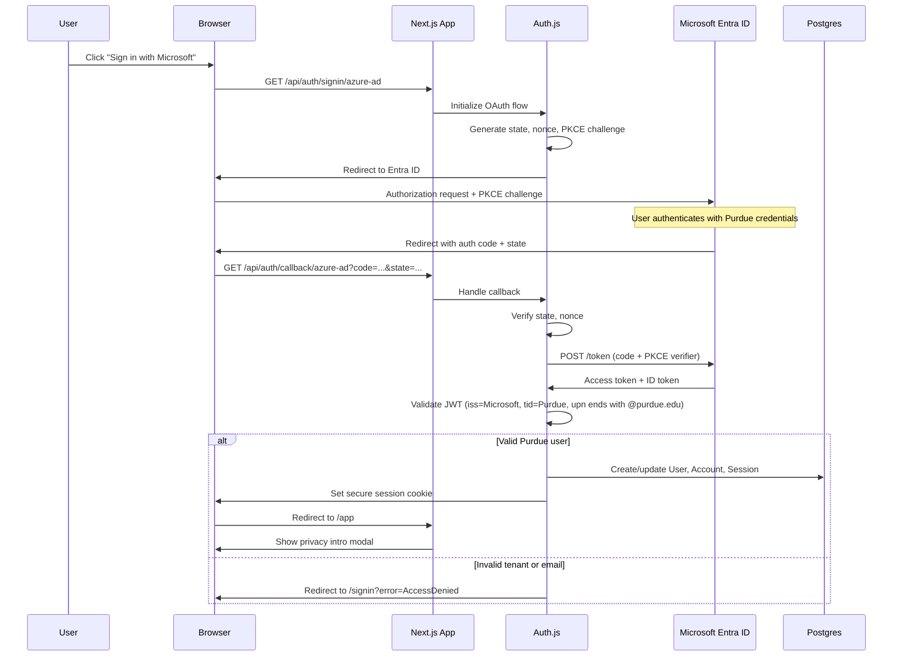

# BoilerAI Privacy-First Sequence Diagrams

## 1. Microsoft Entra ID SSO Login Flow

## 2. First-Device Bootstrap (DEK Generation & Wrapping)

## 3. API Key Storage (Client-Side Encryption)

## 4. Anonymous Metrics Flow (Differential Privacy)

## 5. Redacted Example Sharing Flow

## 6. E2EE Chat History Sync (Optional Feature)

## Security & Privacy Invariants

### Authentication Security
- State and nonce validation prevents CSRF and replay attacks
- PKCE prevents authorization code interception
- Tenant ID validation ensures Purdue-only access
- JWT signature validation against Microsoft's keys

### Client-Side Encryption Guarantees
- DEK never leaves browser in plaintext form
- All vault operations use authenticated encryption (AES-GCM)
- Server stores only ciphertext + nonce, never plaintext
- Non-extractable CryptoKey prevents key export

### Differential Privacy Guarantees  
- Randomized response with calibrated noise (ε=0.5 default)
- No raw events accepted by server
- K-anonymity enforcement (≥20 contributors)
- IP addresses dropped at edge, no user tracking

### Data Retention & Deletion
- Chat history: local-only by default, optional E2EE sync
- Redacted examples: 30-day automatic purge
- Metrics: aggregated only, no per-user data
- Vault items: user-controlled via settings UI