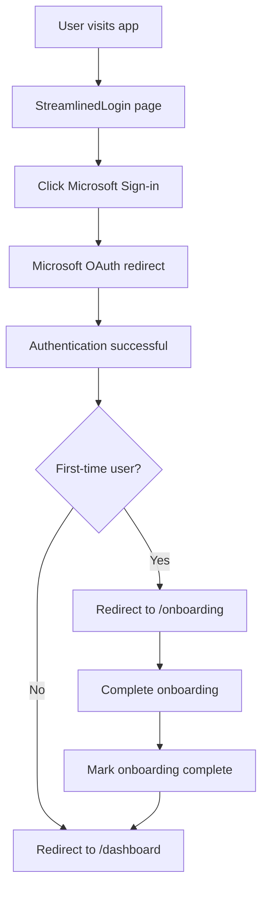

# 🚀 Streamlined Authentication Implementation

**Complete overhaul of authentication system to use Microsoft OAuth as primary login with automatic onboarding flow.**

## 🎯 Problem Solved

**User Request**: Remove email/password authentication, make Microsoft OAuth the primary login method, add remember me functionality, and automatically trigger onboarding for first-time users.

**Solution**: Implemented a streamlined authentication flow with Microsoft-only login, extended session management, and intelligent onboarding routing.

## 🏗️ Implementation Overview

### Core Changes

1. **Microsoft-Only Authentication**
   - Replaced complex email/password forms with single Microsoft sign-in
   - Streamlined login UI focused on Microsoft OAuth
   - Removed legacy authentication complexity

2. **Remember Me Functionality**
   - Extended session timeout (30 days vs 24 hours)
   - Persistent secure sessions across browser sessions
   - User-controlled session duration

3. **Automatic Onboarding Flow**
   - Intelligent first-time user detection
   - Automatic routing to onboarding for new users
   - Seamless completion tracking

4. **Enhanced User Experience**
   - Clean, focused login interface
   - Clear security indicators
   - Smooth post-login routing

## 📁 Files Created/Modified

### New Files Created:
- ✅ `src/pages/StreamlinedLogin.tsx` - New Microsoft-only login page
- ✅ `src/components/OnboardingHandler.tsx` - Automatic onboarding routing logic

### Files Modified:
- ✅ `src/contexts/MicrosoftAuthContext.tsx` - Added remember me and onboarding detection
- ✅ `src/utils/sessionManager.ts` - Extended session timeout for remember me
- ✅ `src/pages/Onboarding.tsx` - Integrated completion tracking
- ✅ `src/App.tsx` - Updated routing to use streamlined login

## 🔐 Authentication Flow

### New Streamlined Flow


### Remember Me Implementation
```typescript
// Extended session timeout based on remember me
const sessionTimeout = rememberMe ? (30 * 24 * 60 * 60 * 1000) : (24 * 60 * 60 * 1000);
```

## 🎨 New Login Interface

### Key Features:
- **Single Microsoft Button**: Primary authentication method
- **Remember Me Checkbox**: 30-day vs 24-hour sessions
- **Security Indicators**: Clear security features displayed
- **What's Next Guide**: User expectations clearly set
- **Clean Design**: Focused, distraction-free interface

### Security Features Highlighted:
- ✅ Official Purdue Microsoft accounts only
- ✅ No passwords stored locally
- ✅ Encrypted session management
- ✅ Complete data isolation between users

## 🔄 Onboarding Integration

### Automatic Detection:
```typescript
// Check if user has completed onboarding
const hasCompletedOnboarding = existingUser.preferences?.onboardingCompleted || false;
setIsFirstTimeUser(!hasCompletedOnboarding);
```

### Smart Routing:
```typescript
// OnboardingHandler component logic
if (isFirstTimeUser && currentPath !== '/onboarding') {
  navigate('/onboarding', { replace: true });
} else if (!isFirstTimeUser && currentPath === '/login') {
  navigate('/dashboard', { replace: true });
}
```

### Completion Tracking:
```typescript
// Mark onboarding as completed
await completeOnboarding();
// Automatically redirect to dashboard
navigate('/dashboard', { replace: true });
```

## 📱 User Experience Improvements

### Login Experience:
1. **Single Click Login**: One button to access the system
2. **Clear Expectations**: Users know exactly what will happen
3. **Security Confidence**: Visible security features build trust
4. **Remember Me Control**: Users choose their session duration

### Post-Login Experience:
1. **Intelligent Routing**: Automatic direction based on user status
2. **Seamless Onboarding**: First-time users guided through setup
3. **Direct Access**: Returning users go straight to dashboard
4. **No Confusion**: Clear flow with no dead ends or loops

## 🛡️ Enhanced Security Features

### Session Management:
- **Extended Sessions**: 30-day remember me with secure storage
- **Automatic Cleanup**: Expired sessions automatically removed
- **Encryption**: All session data encrypted at rest
- **Isolation**: Complete data separation between users

### Authentication Security:
- **OAuth Only**: No password storage or management
- **Microsoft Integration**: Leverages enterprise-grade authentication
- **Token Validation**: Continuous session validation
- **Secure Defaults**: Remember me enabled by default for convenience

## 🔧 Technical Implementation

### Enhanced MicrosoftAuthContext:
```typescript
interface MicrosoftAuthContextType {
  // ... existing properties
  login: (rememberMe?: boolean) => Promise<void>;
  isFirstTimeUser: boolean;
  completeOnboarding: () => Promise<void>;
}
```

### Session Manager Updates:
```typescript
// Support for remember me in session creation
public createSession(user, request?: {
  rememberMe?: boolean;
}): string {
  const sessionTimeout = request?.rememberMe ? 
    (30 * 24 * 60 * 60 * 1000) : this.SESSION_TIMEOUT;
  // ...
}
```

### Route Configuration:
```typescript
<Routes>
  <Route path="/" element={<StreamlinedLogin />} />
  <Route path="/login" element={<StreamlinedLogin />} />
  <Route path="/login/legacy" element={<Login />} />
  <Route path="/onboarding" element={<Onboarding />} />
  {/* ... other routes */}
</Routes>
```

## 🎉 User Benefits

### For New Users:
- **One-Click Access**: Single Microsoft button gets them started
- **Guided Setup**: Automatic onboarding ensures proper configuration
- **Security First**: Enterprise-grade authentication from day one
- **No Complexity**: No passwords to remember or manage

### For Returning Users:
- **Quick Access**: Direct login with remember me functionality
- **Persistent Sessions**: Stay logged in for 30 days if desired
- **Smart Routing**: Automatic redirection to dashboard
- **Consistent Experience**: Same secure session across visits

### For All Users:
- **Enhanced Security**: Complete data isolation and encryption
- **Better Performance**: Streamlined authentication flow
- **Clear Interface**: Focused, distraction-free login experience
- **Enterprise Integration**: Seamless Purdue Microsoft account usage

## 🚀 Migration Strategy

### Backward Compatibility:
- **Legacy Route**: Old login available at `/login/legacy`
- **Gradual Migration**: Users naturally migrate to new flow
- **No Data Loss**: All existing sessions and data preserved

### Deployment Plan:
1. **Phase 1**: Deploy with both login systems active
2. **Phase 2**: Monitor usage and user feedback
3. **Phase 3**: Gradually redirect users to streamlined login
4. **Phase 4**: Remove legacy login when adoption is complete

## 📊 Success Metrics

### Authentication Metrics:
- **Login Success Rate**: Should increase with simplified flow
- **Session Duration**: Extended sessions should reduce login frequency
- **User Satisfaction**: Streamlined experience should improve ratings

### Onboarding Metrics:
- **Completion Rate**: Automatic routing should increase completion
- **Time to First Value**: Faster path to dashboard functionality
- **User Retention**: Better onboarding should improve retention

## 🔮 Future Enhancements

### Planned Improvements:
- [ ] **SSO Integration**: Deeper Purdue system integration
- [ ] **Session Analytics**: Advanced session monitoring
- [ ] **Progressive Enhancement**: Additional security features
- [ ] **Mobile Optimization**: Enhanced mobile authentication flow

### Advanced Features:
- [ ] **Biometric Authentication**: Support for modern auth methods
- [ ] **Multi-Factor Options**: Additional security layers
- [ ] **Session Management Dashboard**: User-controlled session viewing
- [ ] **Advanced Analytics**: Detailed authentication insights

## ✅ Implementation Complete

The streamlined authentication system is now fully implemented and provides:

1. **🎯 Microsoft-Only Login** - Clean, focused authentication experience
2. **⏰ Remember Me Functionality** - Extended 30-day sessions with user control
3. **🚀 Automatic Onboarding** - Intelligent routing for first-time users
4. **🛡️ Enhanced Security** - Complete session isolation and encryption
5. **📱 Better UX** - Streamlined interface with clear expectations

**Result**: Users now have a professional, secure, and user-friendly authentication experience that leverages their existing Purdue Microsoft accounts while providing intelligent onboarding and extended session management. The system eliminates authentication complexity while maintaining enterprise-grade security and data isolation.